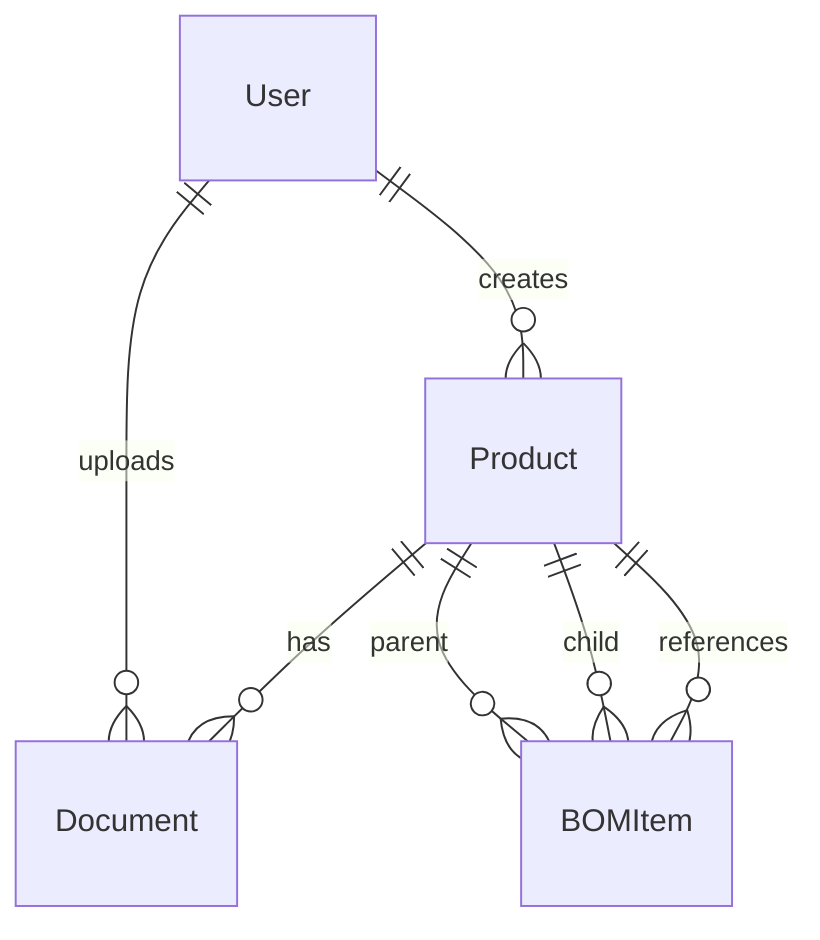

# Database Design Document

## Overview

This document describes the database schema design for the Product Data Management (PDM) System. The database uses PostgreSQL with SQLAlchemy ORM for data management, and includes support for future AI features via the pgvector extension.

---

## Design Summary (Meta)

```yaml
design_type: "new_feature"
risk_level: "low"
complexity_level: "medium"
complexity_rationale: "Standard relational schema with UUID keys; complexity from foreign key relationships and future vector storage"
main_constraints:
  - PostgreSQL 15+ required
  - UUID primary keys for distributed systems
  - Future pgvector extension for semantic search
biggest_risks:
  - Complex BOM self-referential queries
  - Large document storage handling
unknowns:
  - Vector embedding dimension (depends on chosen model)
```

---

## Database Overview

### Database Configuration

| Property | Value |
|----------|-------|
| Host | localhost (Docker: postgres) |
| Port | 5432 |
| Database | pdm_db |
| User | pdm |
| Password | pdm123 |
| Max Connections | 20 |

### Extensions Required

```sql
CREATE EXTENSION IF NOT EXISTS "uuid-ossp";
CREATE EXTENSION IF NOT EXISTS "pgvector";  -- For Phase 2 AI features
```

---

## Entity Relationship Diagram



---

## Table Definitions

### 1. Users Table

Stores user authentication and authorization data.

```sql
CREATE TABLE users (
    id UUID PRIMARY KEY DEFAULT uuid_generate_v4(),
    username VARCHAR(100) UNIQUE NOT NULL,
    email VARCHAR(255) UNIQUE NOT NULL,
    hashed_password VARCHAR(255) NOT NULL,
    full_name VARCHAR(200),
    role VARCHAR(50) DEFAULT 'user',
    is_active BOOLEAN DEFAULT TRUE,
    created_at TIMESTAMP WITH TIME ZONE DEFAULT NOW(),
    last_login TIMESTAMP WITH TIME ZONE
);
```

**Indexes**:
```sql
CREATE INDEX ix_users_username ON users(username);
CREATE INDEX ix_users_email ON users(email);
```

**Columns**:
| Column | Type | Constraints | Description |
|--------|------|-------------|-------------|
| id | UUID | PK, auto | Unique identifier |
| username | VARCHAR(100) | UNIQUE, NOT NULL | Login username |
| email | VARCHAR(255) | UNIQUE, NOT NULL | User email |
| hashed_password | VARCHAR(255) | NOT NULL | bcrypt hash |
| full_name | VARCHAR(200) | NULLABLE | Display name |
| role | VARCHAR(50) | DEFAULT 'user' | 'user' or 'admin' |
| is_active | BOOLEAN | DEFAULT TRUE | Account status |
| created_at | TIMESTAMP | DEFAULT NOW() | Creation time |
| last_login | TIMESTAMP | NULLABLE | Last login time |

---

### 2. Products Table

Stores product master data with version tracking.

```sql
CREATE TABLE products (
    id UUID PRIMARY KEY DEFAULT uuid_generate_v4(),
    product_code VARCHAR(50) UNIQUE NOT NULL,
    name VARCHAR(200) NOT NULL,
    description TEXT,
    category VARCHAR(100),
    version INTEGER DEFAULT 1,
    status VARCHAR(50) DEFAULT 'draft',
    created_by VARCHAR(100),
    created_at TIMESTAMP WITH TIME ZONE DEFAULT NOW(),
    updated_at TIMESTAMP WITH TIME ZONE DEFAULT NOW()
);
```

**Indexes**:
```sql
CREATE INDEX ix_products_product_code ON products(product_code);
CREATE INDEX ix_products_category ON products(category);
CREATE INDEX ix_products_status ON products(status);
CREATE INDEX ix_products_created_at ON products(created_at);
```

**Columns**:
| Column | Type | Constraints | Description |
|--------|------|-------------|-------------|
| id | UUID | PK, auto | Unique identifier |
| product_code | VARCHAR(50) | UNIQUE, NOT NULL | Unique product code |
| name | VARCHAR(200) | NOT NULL | Product name |
| description | TEXT | NULLABLE | Product description |
| category | VARCHAR(100) | NULLABLE | Product category |
| version | INTEGER | DEFAULT 1 | Version number |
| status | VARCHAR(50) | DEFAULT 'draft' | draft/released/obsolete |
| created_by | VARCHAR(100) | NULLABLE | Creator username |
| created_at | TIMESTAMP | DEFAULT NOW() | Creation time |
| updated_at | TIMESTAMP | AUTO | Last update time |

**Status Values**: `draft`, `released`, `obsolete`

---

### 3. Documents Table

Stores document metadata and file references.

```sql
CREATE TABLE documents (
    id UUID PRIMARY KEY DEFAULT uuid_generate_v4(),
    filename VARCHAR(255) NOT NULL,
    filepath VARCHAR(500),
    file_size INTEGER,
    mime_type VARCHAR(100),
    product_id UUID REFERENCES products(id) ON DELETE CASCADE,
    version INTEGER DEFAULT 1,
    status VARCHAR(50) DEFAULT 'active',
    doc_metadata JSONB,
    uploaded_by VARCHAR(100),
    uploaded_at TIMESTAMP WITH TIME ZONE DEFAULT NOW(),
    ocr_text TEXT
);
```

**Indexes**:
```sql
CREATE INDEX ix_documents_product_id ON documents(product_id);
CREATE INDEX ix_documents_status ON documents(status);
CREATE INDEX ix_documents_uploaded_at ON documents(uploaded_at);
```

**Columns**:
| Column | Type | Constraints | Description |
|--------|------|-------------|-------------|
| id | UUID | PK, auto | Unique identifier |
| filename | VARCHAR(255) | NOT NULL | Original filename |
| filepath | VARCHAR(500) | NULLable | MinIO object path |
| file_size | INTEGER | NULLable | Size in bytes |
| mime_type | VARCHAR(100) | NULLable | MIME type |
| product_id | UUID | FK → products.id | Associated product |
| version | INTEGER | DEFAULT 1 | Document version |
| status | VARCHAR(50) | DEFAULT 'active' | active/archived |
| doc_metadata | JSONB | NULLable | Custom metadata |
| uploaded_by | VARCHAR(100) | NULLable | Uploader username |
| uploaded_at | TIMESTAMP | DEFAULT NOW() | Upload time |
| ocr_text | TEXT | NULLable | OCR extracted text |

---

### 4. BOM Items Table

Stores Bill of Materials relationships (parent-child product structure).

```sql
CREATE TABLE bom_items (
    id UUID PRIMARY KEY DEFAULT uuid_generate_v4(),
    parent_product_id UUID REFERENCES products(id) ON DELETE CASCADE,
    child_product_id UUID REFERENCES products(id) ON DELETE CASCADE,
    quantity DECIMAL(10,3) DEFAULT 1,
    unit VARCHAR(50),
    reference VARCHAR(100),
    notes TEXT,
    created_at TIMESTAMP WITH TIME ZONE DEFAULT NOW()
);
```

**Indexes**:
```sql
CREATE INDEX ix_bom_parent ON bom_items(parent_product_id);
CREATE INDEX ix_bom_child ON bom_items(child_product_id);
```

**Unique Constraint**:
```sql
UNIQUE(parent_product_id, child_product_id);
```

**Columns**:
| Column | Type | Constraints | Description |
|--------|------|-------------|-------------|
| id | UUID | PK, auto | Unique identifier |
| parent_product_id | UUID | FK → products.id | Parent product |
| child_product_id | UUID | FK → products.id | Child product |
| quantity | DECIMAL(10,3) | DEFAULT 1 | Quantity needed |
| unit | VARCHAR(50) | NULLable | Unit of measure |
| reference | VARCHAR(100) | NULLable | Reference designator |
| notes | TEXT | NULLable | Additional notes |
| created_at | TIMESTAMP | DEFAULT NOW() | Creation time |

---

### 5. Vector Embeddings Table (Phase 2)

Stores vector embeddings for semantic search.

```sql
CREATE TABLE embeddings (
    id UUID PRIMARY KEY DEFAULT uuid_generate_v4(),
    entity_type VARCHAR(50) NOT NULL,
    entity_id UUID NOT NULL,
    embedding vector(768),
    created_at TIMESTAMP WITH TIME ZONE DEFAULT NOW()
);
```

**Indexes**:
```sql
CREATE INDEX ix_embeddings_entity ON embeddings(entity_type, entity_id);
CREATE INDEX ix_embeddings_vector ON embeddings USING ivfflat (embedding vector_cosine_ops);
```

---

## Relationships

### User → Product
- **Type**: One-to-Many
- **On Delete**: Set NULL (preserve products if user deleted)
- **Reference Column**: `products.created_by`

### User → Document
- **Type**: One-to-Many
- **On Delete**: Set NULL
- **Reference Column**: `documents.uploaded_by`

### Product → Document
- **Type**: One-to-Many
- **On Delete**: Cascade (delete docs when product deleted)
- **Reference Column**: `documents.product_id`

### Product → BOM (Parent)
- **Type**: One-to-Many
- **On Delete**: Cascade
- **Reference Column**: `bom_items.parent_product_id`

### Product → BOM (Child)
- **Type**: One-to-Many
- **On Delete**: Cascade
- **Reference Column**: `bom_items.child_product_id`

---

## Data Integrity Rules

### Constraints

1. **Product Code Uniqueness**: Each product must have a unique code
2. **BOM No Circular Reference**: Self-referential check required in application logic
3. **Quantity Positive**: BOM quantity must be > 0
4. **Valid Status Values**: Only allow predefined status values

### Triggers

```sql
-- Auto-update updated_at timestamp
CREATE OR REPLACE FUNCTION update_updated_at()
RETURNS TRIGGER AS $$
BEGIN
    NEW.updated_at = NOW();
    RETURN NEW;
END;
$$ LANGUAGE plpgsql;

CREATE TRIGGER products_updated_at
    BEFORE UPDATE ON products
    FOR EACH ROW
    EXECUTE FUNCTION update_updated_at();
```

---

## Migration Strategy

Using Alembic for database migrations:

```
alembic revision --autogenerate -m "Initial schema"
alembic upgrade head
```

**Migration Files Location**: `/code/backend/alembic/versions/`

---

## Performance Optimization

### Query Optimization

1. **Indexes on Foreign Keys**: All FK columns indexed
2. **Composite Indexes**: `(product_id, status)` for filtered document queries
3. **Partial Indexes**: For common filter conditions

### Partitioning Strategy

For large datasets, consider:
- Partition `documents` by `created_at` (monthly)
- Partition `embeddings` by `entity_type`

---

## Backup and Recovery

### Backup Strategy
- Daily full backup at 2:00 AM UTC
- Incremental backups every 6 hours
- Retention: 30 days

### Recovery Point Objective (RPO)
- Maximum 1 hour data loss

### Recovery Time Objective (RTO)
- Maximum 4 hours for full recovery

---

## Security Considerations

### Data at Rest
- Database encryption: Enable PostgreSQL encryption
- Tablespace encryption: Use encrypted tablespace

### Data in Transit
- SSL/TLS required for all connections
- Force SSL mode in PostgreSQL config

### Access Control
- Application users have minimal necessary permissions
- Row-level security for multi-tenant (future)

---

## Reference

- SQLAlchemy models: `/code/backend/models.py`
- Pydantic schemas: `/code/backend/schemas.py`
- Database config: `/code/backend/database.py`

---

*Document created: 2026-03-27*
*Status: Draft*
*Version: 1.0*