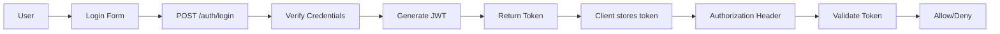

# Security Architecture Document

## Document Information

| Property | Value |
|-----------|-------|
| Version | 1.0 |
| Status | Draft |
| Created | 2026-03-27 |

---

## 1. Security Overview

### 1.1 Security Principles

```
┌─────────────────────────────────────────────────────────────┐
│                  Security Principles                        │
├─────────────────────────────────────────────────────────────┤
│  • Defense in Depth: Multiple layers of protection         │
│  • Least Privilege: Minimal permissions required            │
│  • Zero Trust: Verify every request                         │
│  • Fail Secure: Safe defaults on failure                    │
│  • Keep Simple: Simple is more secure                       │
└─────────────────────────────────────────────────────────────┘
```

### 1.2 Security Objectives

| Objective | Target |
|-----------|--------|
| Confidentiality | Protect sensitive data |
| Integrity | Prevent unauthorized changes |
| Availability | Ensure system accessibility |
| Authentication | Verify user identity |
| Authorization | Control resource access |

---

## 2. Authentication

### 2.1 Authentication Flow



### 2.2 JWT Implementation

| Property | Value |
|----------|-------|
| Algorithm | HS256 |
| Expiration | 1 hour |
| Token Type | Bearer |
| Secret | Environment variable |

**Token Claims:**
```json
{
  "sub": "username",
  "exp": 1234567890,
  "iat": 1234567890,
  "role": "user|admin"
}
```

### 2.3 Password Security

| Measure | Implementation |
|---------|----------------|
| Hashing | bcrypt (cost factor 12) |
| Salting | Automatic via bcrypt |
| Validation | Min 6 characters |
| Storage | Never store plaintext |

---

## 3. Authorization

### 3.1 Role-Based Access Control (RBAC)

| Role | Permissions |
|------|-------------|
| **admin** | Full access: create, read, update, delete all |
| **user** | Read, create, update own resources |
| **guest** | Read public resources only |

### 3.2 Endpoint Permissions

| Endpoint | Method | Required Role |
|----------|--------|---------------|
| /health | GET | None |
| /auth/login | POST | None |
| /auth/register | POST | None |
| /products | GET | user |
| /products | POST | user |
| /products/{id} | PUT | user |
| /products/{id} | DELETE | admin |
| /documents | POST | user |
| /documents/{id}/download | GET | user |
| /bom | POST | user |
| /bom/{id} | DELETE | user |

### 3.3 Authorization Implementation

```python
# Dependency for role checking
def get_current_admin_user(
    current_user: User = Depends(get_current_active_user)
):
    if current_user.role != "admin":
        raise HTTPException(
            status_code=status.HTTP_403_FORBIDDEN,
            detail="Admin permission required"
        )
    return current_user
```

---

## 4. API Security

### 4.1 CORS Configuration

**Development:**
```python
app.add_middleware(
    CORSMiddleware,
    allow_origins=["http://localhost:3000"],
    allow_credentials=True,
    allow_methods=["*"],
    allow_headers=["*"],
)
```

**Production (recommended):**
```python
app.add_middleware(
    CORSMiddleware,
    allow_origins=["https://pdm.example.com"],
    allow_credentials=True,
    allow_methods=["GET", "POST", "PUT", "DELETE"],
    allow_headers=["Authorization", "Content-Type"],
)
```

### 4.2 Rate Limiting (Future)

| Endpoint | Limit | Window |
|----------|-------|--------|
| /auth/login | 5 | 1 minute |
| /api/products | 100 | 1 minute |
| /api/documents | 20 | 1 minute |

### 4.3 Input Validation

| Layer | Validation |
|-------|------------|
| Pydantic | Type checking, format validation |
| SQLAlchemy | Parameterized queries |
| Frontend | Input sanitization |

---

## 5. Data Security

### 5.1 Data Classification

| Level | Data | Examples |
|-------|------|----------|
| **Public** | Non-sensitive | Product names, categories |
| **Internal** | Business data | User email, product codes |
| **Confidential** | Sensitive | Passwords, tokens, personal data |
| **Restricted** | Critical | API keys, admin credentials |

### 5.2 Data Protection

| Data | Protection |
|------|-------------|
| Passwords | bcrypt hashed |
| JWT tokens | Short expiry (1h) |
| API keys | Environment variables only |
| Database | Encrypted connection |

### 5.3 Sensitive Data Handling

```
Never store in code:
├── API keys
├── Database credentials
├── Secret keys
└── Private tokens

Use instead:
├── Environment variables
├── Secret management service
└── .env files (not committed)
```

---

## 6. Network Security

### 6.1 Development Network

```yaml
# docker-compose.yml network
networks:
  pdm-network:
    driver: bridge
    internal: false

services:
  backend:
    networks: [pdm-network]
    expose: [8000]
  
  postgres:
    networks: [pdm-network]
    expose: [5432]
```

### 6.2 Production Network

```
Security Measures:
├── HTTPS only
├── WAF (Web Application Firewall)
├── DDoS protection
├── VPN for admin access
└── VPC isolation
```

---

## 7. Application Security

### 7.1 Vulnerability Prevention

| Vulnerability | Prevention |
|---------------|-------------|
| SQL Injection | SQLAlchemy ORM |
| XSS | React auto-escaping |
| CSRF | JWT tokens (stateless) |
| IDOR | Ownership checks |
| Command Injection | No shell execution |

### 7.2 Security Headers

```python
# In main.py
from fastapi.middleware.trustedhost import TrustedHostMiddleware

app.add_middleware(
    TrustedHostMiddleware,
    allowed_hosts=["localhost", "*.vercel.app"]
)
```

### 7.3 File Upload Security

| Measure | Implementation |
|---------|----------------|
| File type validation | Magic number check |
| Size limit | Max 100MB |
| Filename sanitization | UUID rename |
| Storage | Separate MinIO bucket |

---

## 8. Dependency Security

### 8.1 Dependency Management

```bash
# Python - Check for vulnerabilities
pip install safety
safety check

# JavaScript - Audit dependencies
npm audit
```

### 8.2 Dependency Updates

| Type | Update Frequency |
|------|------------------|
| Security patches | Immediate |
| Minor versions | Monthly |
| Major versions | Quarterly |

---

## 9. Monitoring and Response

### 9.1 Security Logging

| Event | Log Level | Fields |
|-------|-----------|--------|
| Login success | INFO | user, timestamp |
| Login failure | WARNING | username, IP, timestamp |
| Unauthorized access | WARNING | user, endpoint, timestamp |
| Admin actions | INFO | admin, action, timestamp |

### 9.2 Alerting (Future)

| Alert | Trigger |
|-------|---------|
| Failed login threshold | 5 failures in 5 minutes |
| Unusual access pattern | Multiple failed endpoints |
| New admin user | Immediate |
| Large data export | Threshold based |

---

## 10. Security Checklist

### 10.1 Development Checklist

- [ ] Never commit secrets to version control
- [ ] Use environment variables for sensitive data
- [ ] Validate all user inputs
- [ ] Use parameterized queries
- [ ] Implement proper authentication
- [ ] Apply principle of least privilege
- [ ] Keep dependencies updated
- [ ] Write security-focused tests

### 10.2 Production Checklist

- [ ] Enable HTTPS
- [ ] Configure CORS properly
- [ ] Set secure cookie flags
- [ ] Enable security headers
- [ ] Configure firewall rules
- [ ] Set up monitoring/alerting
- [ ] Enable database encryption
- [ ] Configure backup encryption

---

## 11. Future Security Improvements

### Planned Enhancements

| Enhancement | Timeline | Priority |
|-------------|----------|----------|
| OAuth2 integration | Phase 2 | P2 |
| 2FA/MFA | Phase 2 | P2 |
| API key authentication | Phase 2 | P2 |
| Audit logging | Phase 3 | P1 |
| Security scanning | Phase 3 | P1 |

---

## 12. References

| Reference | Location |
|-----------|----------|
| Auth implementation | /code/backend/deps.py |
| Password hashing | /code/backend/utils.py |
| CORS config | /code/backend/main.py |

---

## 13. Compliance

### 13.1 Security Standards

| Standard | Status | Notes |
|----------|--------|-------|
| OWASP Top 10 | Target | Development best practices |
| GDPR | N/A | Personal data handling |
| SOC 2 | N/A | Future consideration |

---

*Document Version: 1.0*
*Last Updated: 2026-03-27*
*Review: Quarterly*