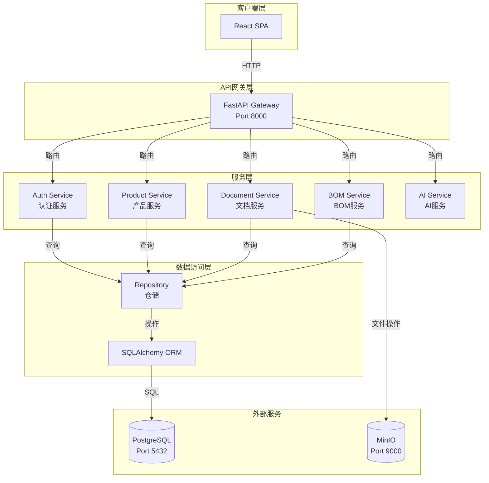
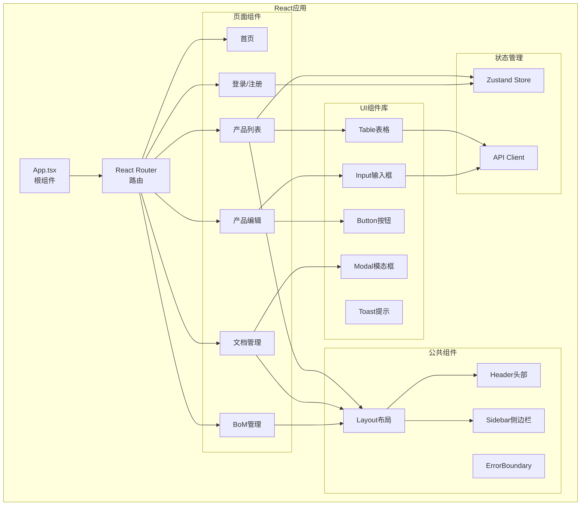
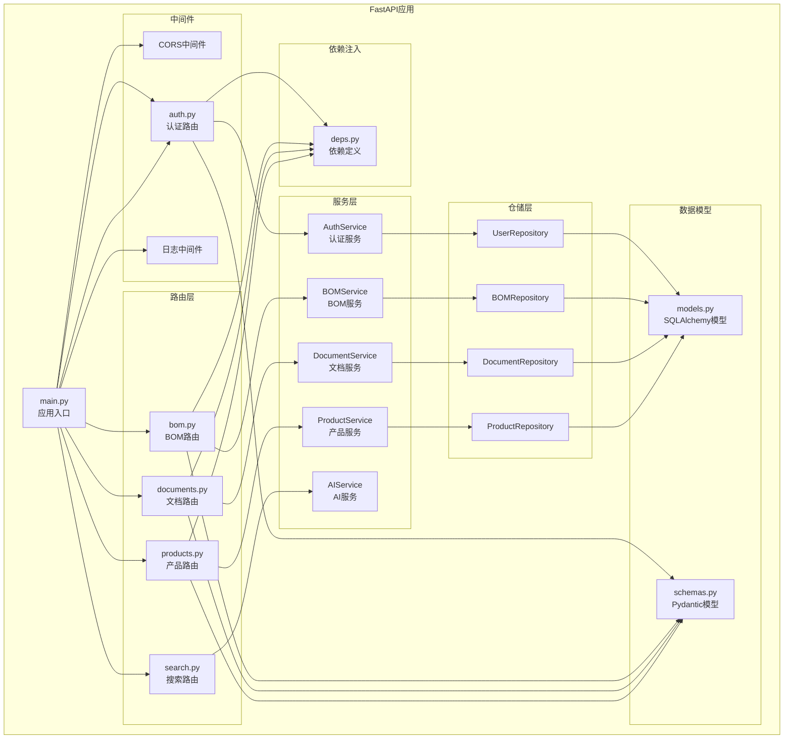
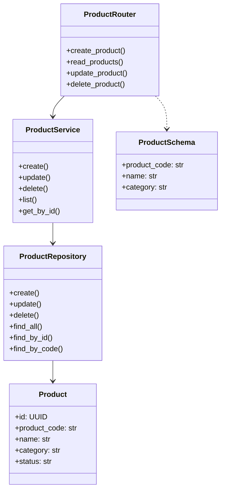
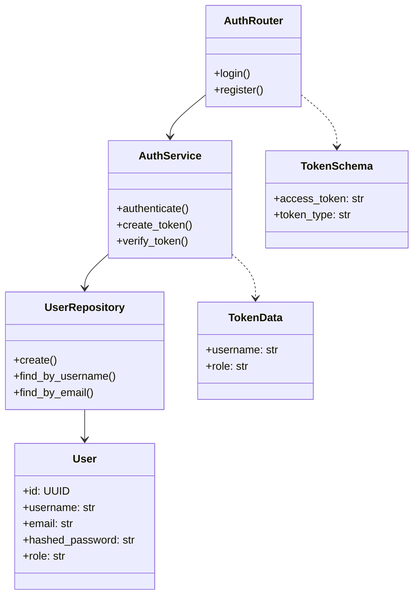
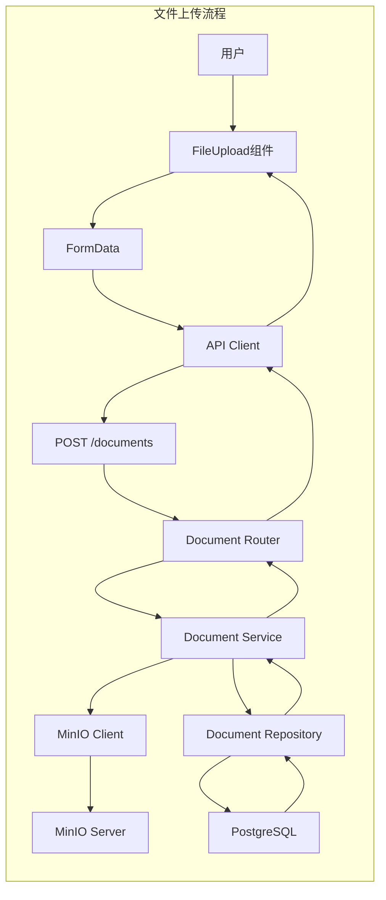
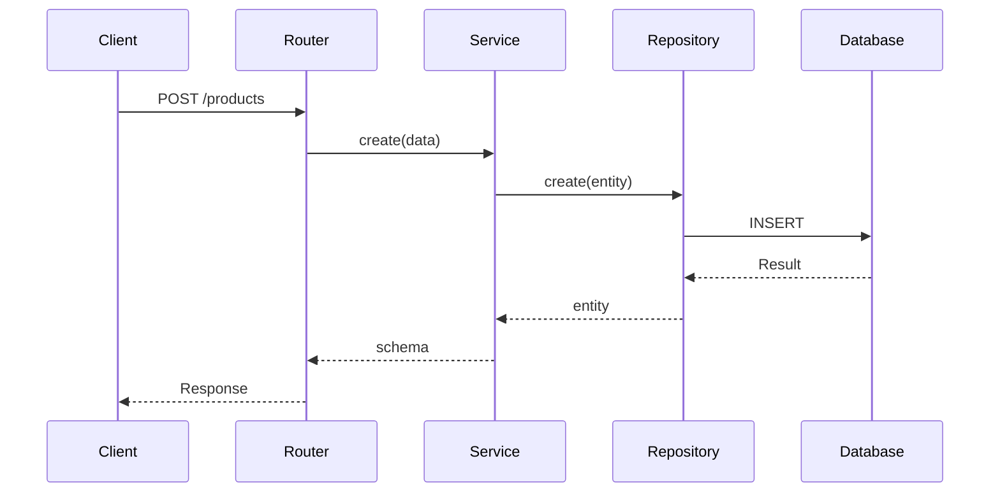
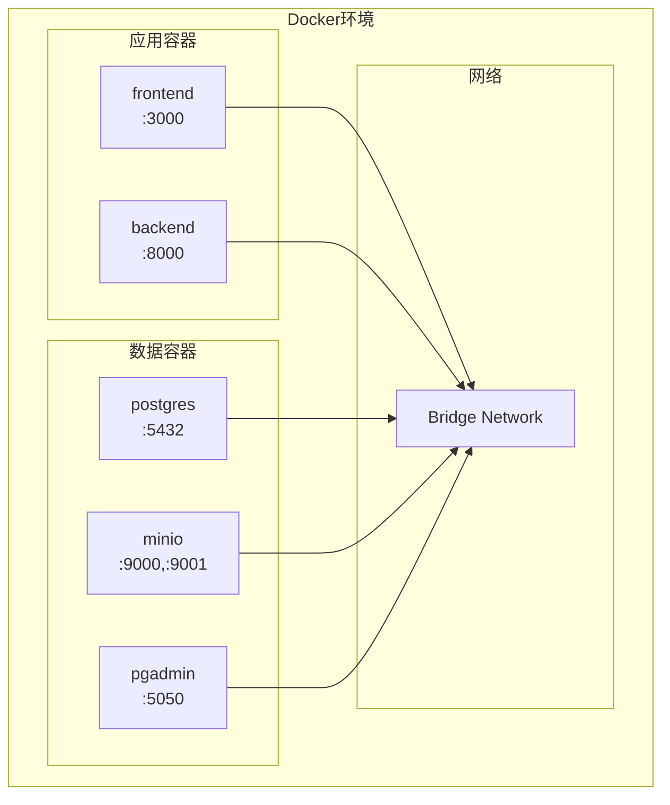

# 组件图 (Component Diagram) 设计文档

## 文档信息

| 属性 | 值 |
|------|------|
| 版本 | 1.0 |
| 状态 | 草稿 |
| 创建日期 | 2026-03-27 |

---

## 1. 系统级组件图

### 1.1 整体架构组件

---

## 2. 前端组件图

### 2.1 前端应用结构

### 2.2 前端组件职责

| 组件 | 职责 | 依赖 |
|------|------|------|
| App | 路由配置, 全局错误处理 | React Router |
| Layout | 页面布局结构 | Header, Sidebar |
| ProductList | 产品列表展示 | Table, Store |
| ProductForm | 产品表单 | Input, Button |
| DocumentUpload | 文件上传 | API, Modal |
| BOMTree | BOM树展示 | 递归组件 |

---

## 3. 后端组件图

### 3.1 后端服务架构

### 3.2 后端组件职责

| 组件 | 职责 | 公开API |
|------|------|---------|
| main.py | 应用配置, 中间件注册 | - |
| routers/ | 请求路由, 响应处理 | HTTP端点 |
| services/ | 业务逻辑, 数据验证 | 业务方法 |
| repositories/ | 数据库操作, 查询 | 仓储方法 |
| models.py | 数据库表结构 | ORM模型 |
| schemas.py | 数据验证, 序列化 | Pydantic模型 |
| deps.py | 依赖注入, 认证 | FastAPI依赖 |

---

## 4. 组件关系图

### 4.1 产品模块组件

### 4.2 认证模块组件

---

## 5. 数据流组件

### 5.1 文件上传组件

---

## 6. 模块交互图

### 6.1 组件时序图

---

## 7. 基础设施组件

### 7.1 Docker容器

---

## 8. 组件依赖矩阵

| 组件 | 前端依赖 | 后端依赖 |
|------|----------|----------|
| React Router | - | 无 |
| Axios | React | 无 |
| Zustand | React | 无 |
| FastAPI | 无 | - |
| SQLAlchemy | 无 | Pydantic |
| MinIO | 无 | Boto3 |

---

*文档版本: 1.0*
*最后更新: 2026-03-27*