# 数据流图 (DFD) 设计文档

## 文档信息

| 属性 | 值 |
|------|------|
| 版本 | 1.0 |
| 状态 | 草稿 |
| 创建日期 | 2026-03-27 |

---

## 1. 系统上下文图 (Level 0)

### 1.1 上下文图定义

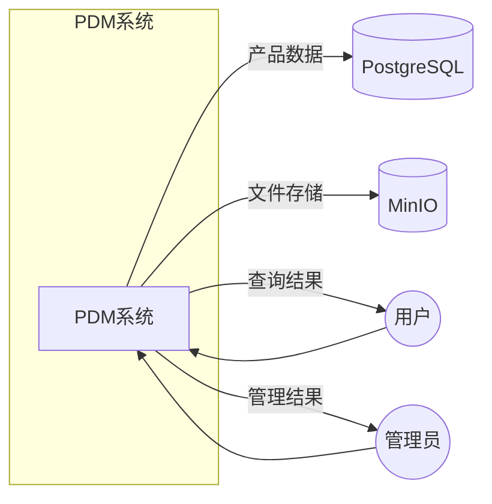

### 1.2 外部实体说明

| 实体 | 类型 | 描述 |
|------|------|------|
| 用户 | 参与者 | 产品经理、工程师 |
| 管理员 | 参与者 | 系统管理员 |
| PostgreSQL | 外部系统 | 数据存储 |
| MinIO | 外部系统 | 文件存储 |

---

## 2. 一级数据流图 (Level 1)

### 2.1 主要功能

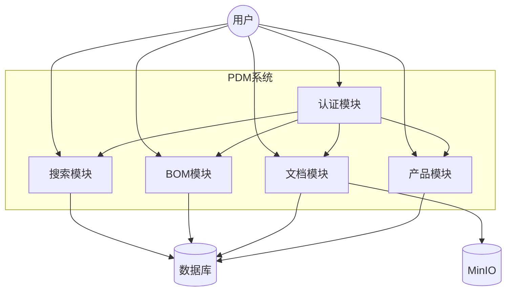

### 2.2 数据流说明

| 数据流 | 来源 | 目的 | 内容 |
|--------|------|------|------|
| 用户凭据 | 用户 | 认证模块 | username, password |
| 认证令牌 | 认证模块 | 用户 | JWT token |
| 产品请求 | 用户 | 产品模块 | CRUD操作 |
| 产品数据 | 产品模块 | 数据库 | 产品记录 |
| 文档上传 | 用户 | 文档模块 | 文件+元数据 |
| 文件存储 | 文档模块 | MinIO | 实际文件 |
| BOM查询 | 用户 | BOM模块 | 树形结构查询 |

---

## 3. 产品模块数据流 (Level 2)

### 3.1 产品CRUD流程

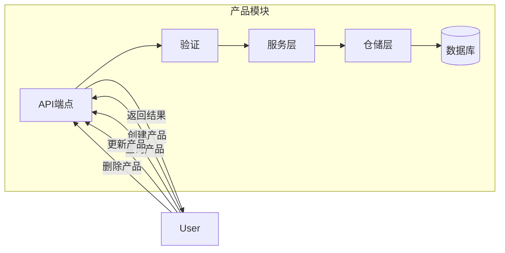

### 3.2 产品创建数据流

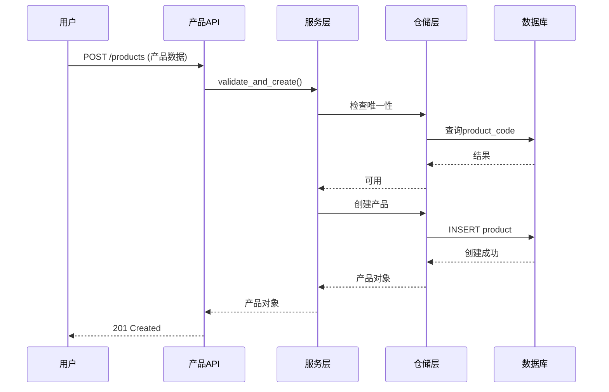

---

## 4. 认证模块数据流

### 4.1 登录流程

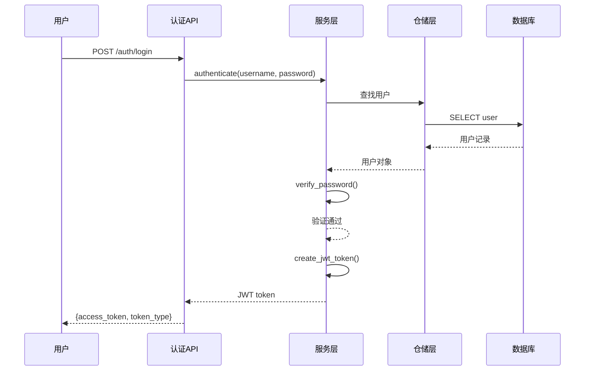

### 4.2 令牌验证流程

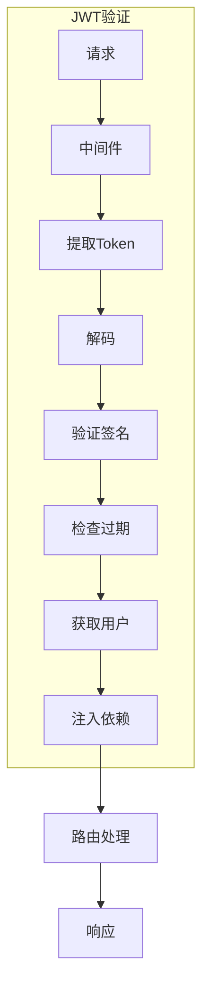

---

## 5. 文档模块数据流

### 5.1 文件上传流程

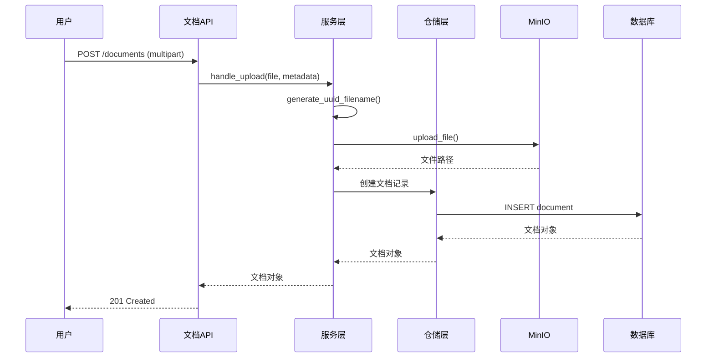

### 5.2 文件下载流程

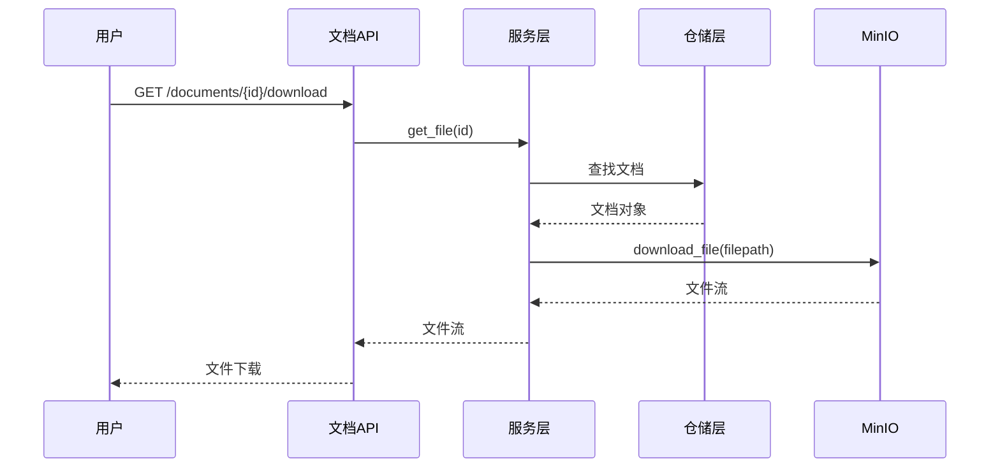

---

## 6. BOM模块数据流

### 6.1 BOM树查询

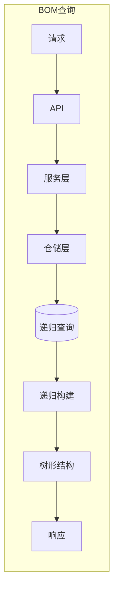

### 6.2 BOM创建

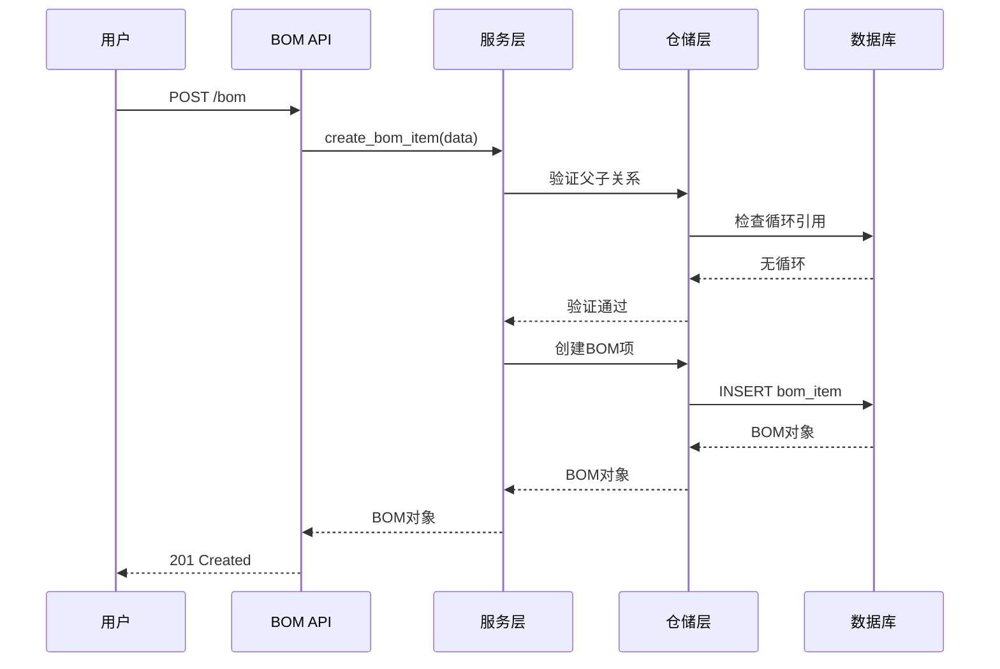

---

## 7. 搜索模块数据流 (Phase 2)

### 7.1 语义搜索流程

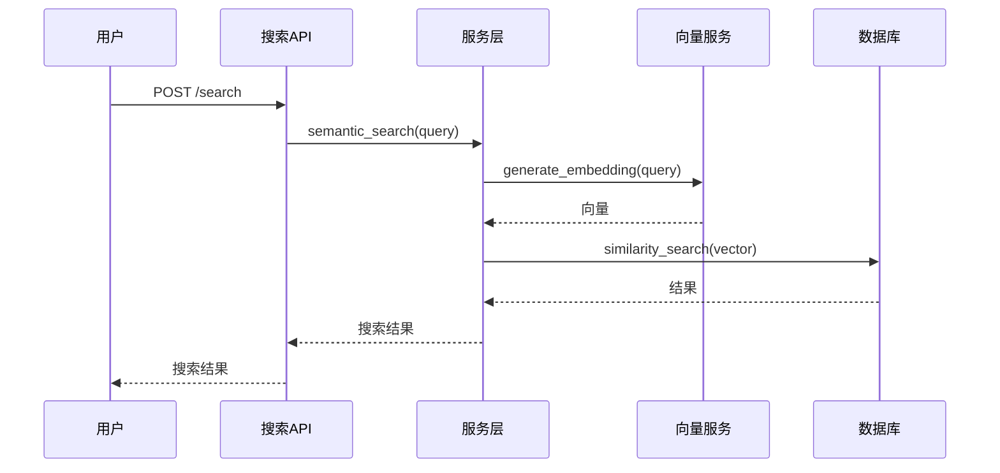

---

## 8. 数据存储流

### 8.1 数据存储对应

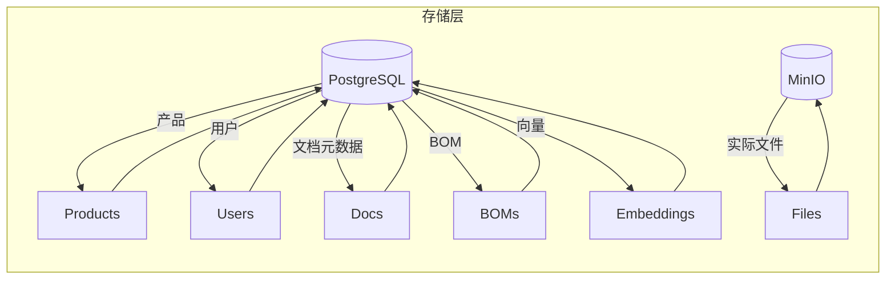

---

## 9. 数据字典

### 9.1 主要数据实体

| 实体 | 存储 | 主要字段 |
|------|------|----------|
| Product | PostgreSQL | product_code, name, category, status |
| User | PostgreSQL | username, email, hashed_password, role |
| Document | PostgreSQL + MinIO | filename, filepath, mime_type, product_id |
| BOMItem | PostgreSQL | parent_product_id, child_product_id, quantity |
| Embedding | PostgreSQL | entity_id, entity_type, vector |

---

## 10. 错误处理流

### 10.1 错误传播

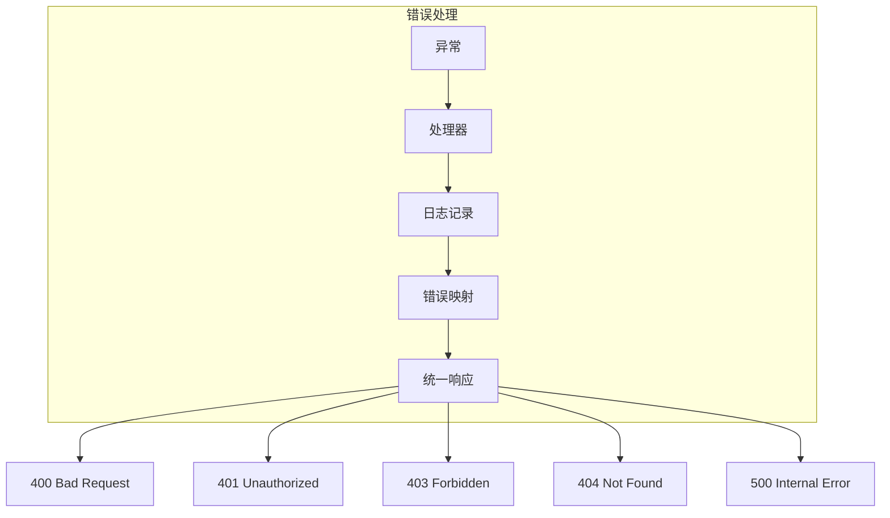

---

*文档版本: 1.0*
*最后更新: 2026-03-27*