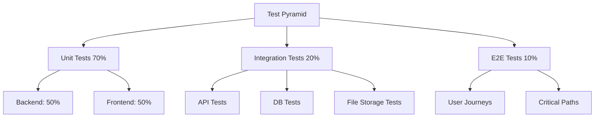

# Test Strategy Document

## Document Information

| Property | Value |
|-----------|-------|
| Version | 1.0 |
| Status | Draft |
| Created | 2026-03-27 |

---

## 1. Test Overview

### 1.1 Purpose

This document defines the testing strategy for the PDM System, ensuring quality across all layers from unit tests to end-to-end validation.

### 1.2 Test Philosophy

```
┌─────────────────────────────────────────────────────────────┐
│                    Test Philosophy                          │
├─────────────────────────────────────────────────────────────┤
│  • Quality over quantity: meaningful tests                  │
│  • Fast feedback: automated on every change                │
│  • Test behavior, not implementation                        │
│  • Maintainable: clear naming, good docs                    │
└─────────────────────────────────────────────────────────────┘
```

---

## 2. Test Pyramid

### 2.1 Layer Distribution



### 2.2 Target Ratios

| Level | Percentage | Count (estimated) |
|-------|------------|-------------------|
| Unit | 70% | 100+ tests |
| Integration | 20% | 20+ tests |
| E2E | 10% | 10+ tests |

---

## 3. Test Types

### 3.1 Unit Tests

#### Backend Unit Tests

| Module | Test Focus | Tools |
|--------|------------|-------|
| schemas | Validation rules | pytest |
| services | Business logic | pytest |
| utils | Helper functions | pytest |

**Example Test Structure:**
```
tests/
├── test_products/
│   ├── test_create.py
│   ├── test_update.py
│   ├── test_delete.py
│   └── test_list.py
├── test_auth/
│   ├── test_login.py
│   ├── test_register.py
│   └── test_jwt.py
└── test_utils/
    ├── test_validators.py
    └── test_helpers.py
```

#### Frontend Unit Tests

| Module | Test Focus | Tools |
|--------|------------|-------|
| components | Rendering, props | Vitest + RTL |
| hooks | State changes | Vitest |
| utils | Helper functions | Vitest |

### 3.2 Integration Tests

| Category | Test Scope | Dependencies |
|----------|------------|--------------|
| API Integration | Full API flow | PostgreSQL |
| Database Integration | CRUD operations | PostgreSQL |
| File Storage | Upload/download | MinIO |
| Authentication | Login flow | PostgreSQL |

### 3.3 E2E Tests

| Scenario | User Journey |
|----------|--------------|
| Product Management | Create → View → Edit → Delete |
| Document Upload | Select file → Upload → Download |
| Authentication | Register → Login → Logout |
| BOM Creation | Add items → View tree → Edit |

---

## 4. Test Coverage Goals

### 4.1 Coverage Targets

| Area | Current | Target | Priority |
|------|---------|--------|----------|
| Backend API | 0% | 80% | P0 |
| Backend Services | 0% | 70% | P0 |
| Frontend Components | 0% | 60% | P1 |
| Utility Functions | 0% | 90% | P1 |

### 4.2 Coverage Requirements

```
Minimum Coverage:
├── Line coverage: 70%
├── Branch coverage: 60%
├── Function coverage: 80%
└── Critical path: 100%

Exclusions:
├── Test files
├── Generated code
├── Configuration files
└── Migrations
```

---

## 5. Test Environments

### 5.1 Environment Matrix

| Environment | Purpose | Database | File Storage |
|-------------|---------|----------|--------------|
| **Local** | Development | Local PostgreSQL | Local MinIO |
| **CI** | Automated testing | Test container | Mock |
| **Staging** | Pre-production | Staging DB | Staging MinIO |
| **Production** | Live system | Production DB | Production S3 |

### 5.2 Local Development Testing

```bash
# Start test environment
docker-compose -f docker-compose.test.yml up

# Run backend tests
pytest --cov=backend --cov-report=html

# Run frontend tests
npm run test:coverage

# Run E2E tests
npm run test:e2e
```

---

## 6. Testing Tools

### 6.1 Backend Tools

| Tool | Purpose | Configuration |
|------|---------|---------------|
| pytest | Test framework | pytest.ini |
| pytest-asyncio | Async support | - |
| pytest-cov | Coverage | --cov |
| httpx | HTTP client | - |

### 6.2 Frontend Tools

| Tool | Purpose | Configuration |
|------|---------|---------------|
| Vitest | Test framework | vitest.config.ts |
| React Testing Library | Component testing | - |
| MSW | API mocking | handlers.ts |
| Playwright | E2E testing | playwright.config.ts |

---

## 7. Test Execution

### 7.1 Running Tests

```bash
# Backend - All tests
pytest

# Backend - Specific module
pytest tests/test_products.py

# Backend - With coverage
pytest --cov=backend --cov-report=term-missing

# Frontend - All tests
npm run test

# Frontend - Watch mode
npm run test:watch

# Frontend - Coverage
npm run test:coverage

# E2E - All tests
npm run test:e2e

# E2E - Specific browser
npm run test:e2e -- --project=chromium
```

### 7.2 CI Pipeline

```yaml
# .github/workflows/test.yml
name: Test

on: [push, pull_request]

jobs:
  test:
    runs-on: ubuntu-latest
    
    services:
      postgres:
        image: postgres:15
        env:
          POSTGRES_PASSWORD: test
        options: >-
          --health-cmd pg_isready
          --health-interval 10s
          --health-retries 5
    
    steps:
      - uses: actions/checkout@v3
      
      - name: Run backend tests
        run: |
          pip install -r requirements.txt
          pytest --cov=backend
      
      - name: Run frontend tests
        run: |
          npm install
          npm run test:coverage
```

---

## 8. Test Data Management

### 8.1 Fixtures

```python
# tests/fixtures.py
import pytest
from sqlalchemy import create_engine
from sqlalchemy.orm import sessionmaker

@pytest.fixture
def test_db():
    """Create test database"""
    engine = create_engine("sqlite:///:memory:")
    Base.metadata.create_all(engine)
    yield engine
    Base.metadata.drop_all(engine)

@pytest.fixture
def test_client(test_db):
    """Create test client with database"""
    return TestClient(app, database=test_db)

@pytest.fixture
def sample_product(test_db):
    """Sample product for testing"""
    return Product(
        product_code="TEST-001",
        name="Test Product"
    )
```

### 8.2 Mock Data

```typescript
// frontend/src/mocks/handlers.ts
export const productHandlers = [
  rest.get('/api/v1/products', (req, res, ctx) => {
    return res(
      ctx.json({
        items: [mockProduct],
        total: 1
      })
    );
  }),
];
```

---

## 9. Test Naming Conventions

### 9.1 Backend

```
test_<module>_<action>_<scenario>

Examples:
test_products_create_success
test_products_create_duplicate_code
test_products_update_not_found
test_products_delete_unauthorized
```

### 9.2 Frontend

```
<ComponentName>.test.tsx
<ComponentName>.spec.tsx

Examples:
ProductTable.test.tsx
ProductForm.test.tsx
useProducts.test.ts
```

---

## 10. Quality Gates

### 10.1 Pre-commit Gates

| Gate | Command | Threshold |
|------|---------|-----------|
| Lint | eslint / black | 0 errors |
| Type Check | tsc --noEmit | 0 errors |
| Unit Tests | pytest | 80% pass |
| Formatting | prettier | 0 diff |

### 10.2 Pre-merge Gates

| Gate | Command | Threshold |
|------|---------|-----------|
| Full Tests | pytest | 70% coverage |
| E2E Tests | playwright | All pass |
| Security Scan | bandit | 0 High |

---

## 11. Test Maintenance

### 11.1 Review Checklist

- [ ] Test name describes behavior
- [ ] Test has clear docstring
- [ ] Test uses fixtures properly
- [ ] Assertions are specific
- [ ] No hardcoded values
- [ ] Test is isolated
- [ ] Teardown is complete

### 11.2 Technical Debt

| Debt | Impact | Resolution |
|------|--------|------------|
| Flaky tests | Trust erosion | Fix or remove |
| Missing coverage | Quality risk | Add tests |
| Outdated tests | Maintenance | Update or delete |
| Slow tests | Productivity | Optimize |

---

## 12. Reporting

### 12.1 Coverage Reports

```
Output:
├── htmlcov/           # HTML report
├── coverage.xml      # CI integration
└── coverage.json     # Custom parsing
```

### 12.2 Test Results

```
CI Output:
├── Test Results
├── Coverage Summary
├── Flaky Test List
└── Performance Metrics
```

---

## 13. Future Test Improvements

### Planned Enhancements

| Enhancement | Timeline | Priority |
|-------------|----------|----------|
| Property-based testing | Phase 2 | P2 |
| Performance benchmarking | Phase 2 | P2 |
| Security tests | Phase 3 | P1 |
| Visual regression tests | Phase 3 | P2 |

---

## 14. References

| Reference | Location |
|-----------|----------|
| Backend Tests | /code/backend/tests/ |
| Frontend Tests | /code/frontend/src/__tests__/ |
| E2E Tests | /code/frontend/tests/e2e/ |
| pytest config | /code/backend/pytest.ini |
| vitest config | /code/frontend/vitest.config.ts |

---

*Document Version: 1.0*
*Last Updated: 2026-03-27*
*Next Review: After test implementation*