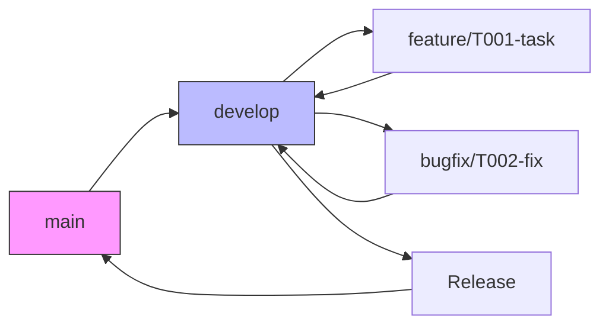
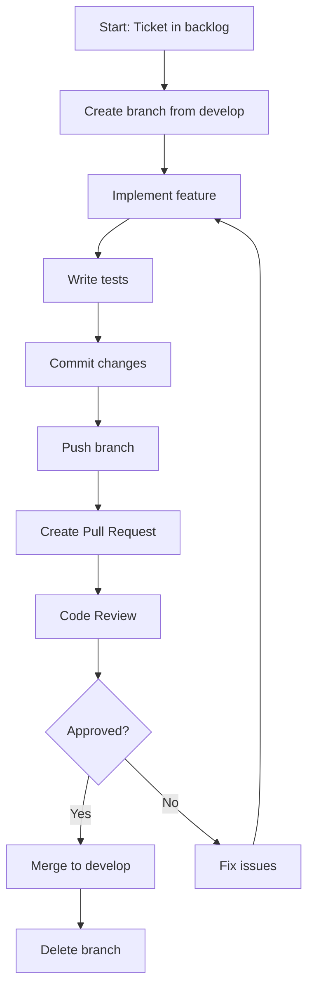

# Version Control Strategy

## Document Information

| Property | Value |
|-----------|-------|
| Version | 1.0 |
| Status | Draft |
| Created | 2026-03-27 |

---

## 1. Repository Structure

### 1.1 Repository Organization

```
pdm-project/
├── .github/              # GitHub Actions workflows
├── .gitignore            # Ignore patterns
├── README.md             # Project overview
├── LICENSE               # Open source license
├── docker-compose.yml    # Local development
├── docs/                 # Documentation
│   ├── prd/             # Product requirements
│   ├── design/          # Design documents
│   ├── architecture/    # Architecture docs
│   ├── test/            # Test docs
│   └── mbse/            # MBSE artifacts
├── plan/                 # Project planning
├── resources/            # Learning resources
├── tasks/                # Task management
├── progress/             # Progress tracking
└── code/                 # Source code
    ├── backend/          # FastAPI backend
    └── frontend/        # React frontend
```

---

## 2. Branching Strategy

### 2.1 Branch Types

| Branch | Purpose | Lifetime | Naming |
|--------|---------|----------|--------|
| **main** | Production code | Permanent | - |
| **develop** | Integration branch | Permanent | - |
| **feature/** | New features | Temporary | feature/T###-description |
| **bugfix/** | Bug fixes | Temporary | bugfix/T###-description |
| **docs/** | Documentation | Temporary | docs/document-name |
| **refactor/** | Code refactoring | Temporary | refactor/component-name |

### 2.2 Branch Flow



### 2.3 Branch Naming Conventions

```
# Feature branches
feature/T001-user-auth
feature/T002-product-crud
feature/T003-document-upload

# Bugfix branches
bugfix/T004-login-error
bugfix/T005-upload-timeout

# Documentation
docs/add-api-design
docs/update-readme

# Refactoring
refactor/product-service
refactor/frontend-state
```

---

## 3. Commit Strategy

### 3.1 Commit Message Format

```
<type>(<scope>): <subject>

<body>

<footer>
```

**Types:**
| Type | Description |
|------|-------------|
| feat | New feature |
| fix | Bug fix |
| docs | Documentation |
| style | Code style (formatting) |
| refactor | Code refactoring |
| test | Test updates |
| chore | Maintenance |

**Examples:**
```
feat(auth): add JWT token validation middleware

- Implement token validation in deps.py
- Add get_current_active_user dependency
- Protect write operations

Closes #12
```

```
fix(products): handle duplicate product codes

- Add unique constraint check before create
- Return 400 error with clear message
- Add test for duplicate code scenario
```

### 3.2 Commit Frequency

```
Guidelines:
├── Commit small, commit often
├── One logical change per commit
├── Never break the build
└── Write meaningful messages
```

---

## 4. Workflow

### 4.1 Feature Development Flow



### 4.2 Pull Request Process

**Creating a PR:**
1. Branch from `develop`
2. Make changes with atomic commits
3. Push and create PR
4. Fill PR template
5. Request review

**PR Template:**
```markdown
## Description
Brief description of changes

## Type of Change
- [ ] New feature
- [ ] Bug fix
- [ ] Documentation
- [ ] Refactoring

## Testing
- [ ] Unit tests added/updated
- [ ] Integration tests pass
- [ ] Manual testing completed

## Checklist
- [ ] Code follows style guidelines
- [ ] Documentation updated
- [ ] No debug code
- [ ] No sensitive data
```

### 4.3 Code Review Checklist

**Reviewer checks:**
- [ ] Code follows conventions
- [ ] Logic is correct
- [ ] Tests are adequate
- [ ] No security issues
- [ ] No performance issues
- [ ] Documentation updated

---

## 5. Version Numbering

### 5.1 Semantic Versioning

```
MAJOR.MINOR.PATCH

Example: 1.0.0
├── MAJOR: Incompatible API changes
├── MINOR: New functionality (backward compatible)
└── PATCH: Bug fixes (backward compatible)
```

### 5.2 Version Progression

| Phase | Version | Notes |
|-------|---------|-------|
| Development | 0.1.0 → 0.x.0 | Pre-1.0 |
| MVP Release | 1.0.0 | First stable |
| Feature Updates | 1.1.0, 1.2.0 | New features |
| Bug Fixes | 1.0.1, 1.0.2 | Fixes only |

---

## 6. Tagging

### 6.1 Tag Types

| Tag | Purpose | Example |
|-----|---------|---------|
| **Release** | Stable releases | v1.0.0 |
| **Milestone** | Phase completion | m4-complete |
| **Beta** | Testing versions | v1.0.0-beta |

### 6.2 Tag Commands

```bash
# Create release tag
git tag -a v1.0.0 -m "Release version 1.0.0"

# Push tags
git push origin --tags

# List tags
git tag -l
```

---

## 7. GitHub Actions

### 7.1 CI Pipeline

```yaml
# .github/workflows/ci.yml
name: CI

on:
  push:
    branches: [main, develop]
  pull_request:
    branches: [main, develop]

jobs:
  test:
    runs-on: ubuntu-latest
    
    steps:
      - uses: actions/checkout@v3
      
      - name: Set up Python
        uses: actions/setup-python@v4
        with:
          python-version: '3.11'
      
      - name: Install dependencies
        run: pip install -r requirements.txt
      
      - name: Run tests
        run: pytest --cov
      
      - name: Upload coverage
        uses: codecov/codecov-action@v3
```

### 7.2 CD Pipeline (Future)

```yaml
# .github/workflows/deploy.yml
name: Deploy

on:
  push:
    branches: [main]
    tags: ['v*']

jobs:
  deploy:
    runs-on: ubuntu-latest
    steps:
      - uses: actions/checkout@v3
      - name: Deploy to production
        run: ./deploy.sh
```

---

## 8. Best Practices

### 8.1 Do's

| Practice | Description |
|----------|-------------|
| ✅ Commit often | Small, focused commits |
| ✅ Write good messages | Clear, descriptive |
| ✅ Review before push | Check diff first |
| ✅ Sync regularly | Pull from develop frequently |
| ✅ Use branches | Never commit to main directly |
| ✅ Test before merge | Ensure CI passes |

### 8.2 Don'ts

| Practice | Description |
|----------|-------------|
| ❌ Large commits | Hard to review |
| ❌ Vague messages | "Fixed stuff" is bad |
| ❌ Skip tests | Break the build |
| ❌ Commit secrets | Use environment variables |
| ❌ Force push main | Never force push |
| ❌ Leave stale branches | Delete after merge |

---

## 9. Conflict Resolution

### 9.1 Rebase Workflow

```bash
# Keep your branch up to date
git fetch origin
git rebase origin/develop

# If conflicts:
# 1. Fix conflicts
# 2. git add .
# 3. git rebase --continue
# 4. git push --force
```

### 9.2 Merge vs Rebase

| Scenario | Strategy |
|----------|----------|
| Feature branch | Rebase onto develop |
| Shared branch | Merge develop into branch |
| Release branch | Merge only |

---

## 10. Maintenance

### 10.1 Branch Cleanup

```bash
# Delete merged branches
git branch --merged develop | grep -v "develop" | xargs -n 1 git branch -d

# Delete remote branches
git push origin --delete feature/old-branch
```

### 10.2 Repository Health

```
Regular Maintenance:
├── Remove stale branches
├── Update dependencies
├── Clean up old tags
├── Verify CI/CD works
└── Review code coverage
```

---

## 11. Quick Reference

### 11.1 Common Commands

```bash
# Start new feature
git checkout -b feature/T001-description develop

# Save work in progress
git stash

# Update from develop
git fetch origin
git rebase origin/develop

# Commit changes
git add .
git commit -m "feat: add new feature"

# Push and create PR
git push -u origin feature/T001-description

# Merge after approval
git checkout develop
git merge --no-ff feature/T001-description
git push origin develop
```

---

## 12. References

| Reference | Location |
|-----------|----------|
| GitHub repo | (to be created) |
| Actions workflows | .github/workflows/ |
| Commit history | git log |

---

*Document Version: 1.0*
*Last Updated: 2026-03-27*
*Review: On project setup*