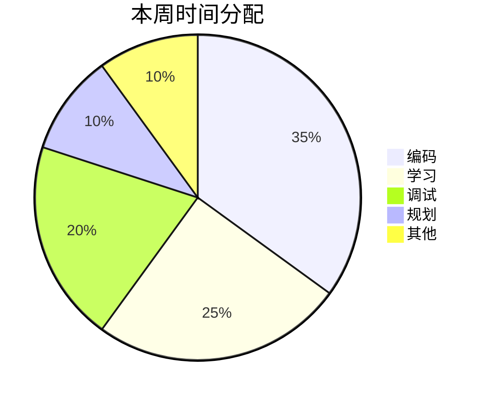

# 周度复盘

## 复盘说明
- **复盘时间**：每周五或周日晚上
- **复盘时长**：30-60分钟
- **复盘目的**：总结进展，发现问题，调整计划，持续改进

---

## 周度复盘模板

```
## 第1周复盘（3月27日 - 4月2日）

### 基本信息
- **复盘日期**：2026-04-02
- **复盘人**：[您的名字]
- **本周总投入**：[小时]小时
- **计划任务数**：[数字]个
- **完成任务数**：[数字]个
- **完成率**：[百分比]%

### 本周成果

#### 任务完成情况
| 任务 | 状态 | 耗时 | 质量 | 学习价值 |
|------|------|------|------|----------|
| T001 | ✅ | 1.5h | ⭐️⭐️⭐️⭐️☆ | ⭐️⭐️⭐️⭐️⭐️ |
| T002 | ✅ | 3h | ⭐️⭐️⭐️⭐️⭐️ | ⭐️⭐️⭐️⭐️☆ |
| T003 | 🟡 | 2h | ⭐️⭐️⭐️☆ | ⭐️⭐️⭐️⭐️☆ |
| T004 | ❌ | - | - | - |

**说明**：
- ✅：完成，🟡：部分完成，❌：未开始

#### 关键成果
1. **[成果1]**：[详细描述]
2. **[成果2]**：[详细描述]
3. **[成果3]**：[详细描述]

#### 技术突破
- [技术突破1]
- [技术突破2]
- [技术突破3]

### 学习收获

#### 新学到的技能
1. **[技能1]**：[掌握程度和应用]
2. **[技能2]**：[掌握程度和应用]
3. **[技能3]**：[掌握程度和应用]

#### 深入理解的概念
- [概念1]：以前[误解]，现在理解[正确理解]
- [概念2]：以前[不知道]，现在知道[新知识]
- [概念3]：以前[模糊]，现在清晰[清晰理解]

#### 解决问题的能力提升
- [问题类型1]：现在能用[方法]解决
- [问题类型2]：现在知道[策略]应对
- [问题类型3]：现在能避免[错误]

### 遇到的问题与挑战

#### 技术问题
1. **[问题描述]**
   - **影响**：[对进度的影响]
   - **原因分析**：[根本原因]
   - **解决方案**：[如何解决的]
   - **预防措施**：[如何避免再次发生]

2. **[问题描述]**
   - [详细分析]

#### 时间管理问题
1. **[问题描述]**
   - [分析]
   - [改进措施]

2. **[问题描述]**
   - [分析]
   - [改进措施]

#### 学习效率问题
1. **[问题描述]**
   - [分析]
   - [改进措施]

### 数据统计

#### 时间投入分析


#### 任务完成趋势
- **周一**：完成3个任务
- **周二**：完成2个任务
- **周三**：完成1个任务
- **周四**：完成2个任务
- **周五**：完成1个任务
- **周末**：完成1个任务

#### 效率指标
- **平均每日有效学习时间**：[数字]小时
- **任务平均耗时**：[数字]小时（预估：[数字]小时）
- **代码提交频率**：[数字]次/天
- **问题解决平均时间**：[数字]小时

### 自我评估

#### 优点（保持）
1. [优点1]：[具体表现]
2. [优点2]：[具体表现]
3. [优点3]：[具体表现]

#### 不足（改进）
1. [不足1]：[具体表现和改进计划]
2. [不足2]：[具体表现和改进计划]
3. [不足3]：[具体表现和改进计划]

#### 满意度评分（1-5分）
- **进度满意度**：[分数]分 - [理由]
- **学习效果**：[分数]分 - [理由]
- **代码质量**：[分数]分 - [理由]
- **总体满意度**：[分数]分 - [理由]

### AI辅助效果评估

#### AI使用情况
- **咨询次数**：[数字]次
- **主要用途**：[用途1]、[用途2]、[用途3]
- **平均响应质量**：[评分]/5分

#### 最有价值的AI帮助
1. **[帮助1]**：[具体帮助和效果]
2. **[帮助2]**：[具体帮助和效果]
3. **[帮助3]**：[具体帮助和效果]

#### AI使用技巧提升
- [技巧1]：学会了如何[技巧]
- [技巧2]：掌握了[方法]
- [技巧3]：改进了[方式]

### 下周改进计划

#### 技术改进
1. **[改进1]**：[具体行动]
2. **[改进2]**：[具体行动]
3. **[改进3]**：[具体行动]

#### 时间管理改进
1. **[改进1]**：[具体行动]
2. **[改进2]**：[具体行动]
3. **[改进3]**：[具体行动]

#### 学习方法改进
1. **[改进1]**：[具体行动]
2. **[改进2]**：[具体行动]
3. **[改进3]**：[具体行动]

### 下周计划调整

#### 原计划 vs 调整后计划
| 任务 | 原计划 | 调整后 | 调整原因 |
|------|--------|--------|----------|
| T005 | 周一 | 周二 | 本周进度稍慢 |
| T006 | 周二 | 周三 | 需要更多学习时间 |
| T007 | 周三 | 周四 | 依赖任务调整 |

#### 优先级调整
- **提升优先级**：[任务] - 原因
- **降低优先级**：[任务] - 原因
- **新增任务**：[任务] - 原因

#### 时间分配调整
- **增加**：[活动]时间，从[数字]到[数字]小时
- **减少**：[活动]时间，从[数字]到[数字]小时
- **保持**：[活动]时间，[数字]小时

### 激励与奖励

#### 本周成就奖励
- [成就1]：[奖励内容]
- [成就2]：[奖励内容]
- [成就3]：[奖励内容]

#### 下周目标奖励
- 如果完成[目标]：[奖励内容]
- 如果达到[指标]：[奖励内容]
- 如果学会[技能]：[奖励内容]

### 长期影响

#### 对项目的影响
- [影响1]：[对项目的长期影响]
- [影响2]：[对项目的长期影响]
- [影响3]：[对项目的长期影响]

#### 对个人成长的影响
- [成长1]：[对个人能力的提升]
- [成长2]：[对职业发展的帮助]
- [成长3]：[对学习方法的改进]

### 总结

#### 一句话总结本周
[用一句话概括本周]

#### 最大的收获
[本周最大的收获]

#### 最需要改进的
[最需要改进的地方]

#### 对未来的展望
[对下周/未来的期望]

---
```

---

## 复盘指导原则

### 复盘的意义
1. **避免重复错误**：记录问题，防止再犯
2. **巩固学习成果**：总结收获，加深理解
3. **调整方向**：根据实际情况调整计划
4. **保持动力**：看到进步，增强信心
5. **培养习惯**：形成持续改进的循环

### 有效的复盘方法
1. **事实为基础**：基于数据，避免主观臆断
2. **全面不偏颇**：既看成果，也看问题
3. **具体不空泛**：具体到任务、时间、效果
4. **积极不抱怨**：关注改进，不纠结失败
5. **行动导向**：每个问题都有改进计划

### 常见复盘误区
1. **形式化**：为了复盘而复盘，没有实质内容
2. **责备性**：聚焦指责，而不是解决问题
3. **表面化**：只讲现象，不分析根本原因
4. **孤立化**：不与前后复盘关联
5. **无行动**：只有总结，没有改进措施

---

## 月度复盘模板

### 月度复盘要点
1. **目标达成度**：对比月初目标和实际完成
2. **技能增长**：掌握的技能和知识
3. **项目进展**：项目整体状态
4. **习惯养成**：形成的良好习惯
5. **下月规划**：基于本月的调整

### 月度复盘时间
- 每月最后一周的周日
- 时长：1-2小时
- 结合四周的周度复盘

---

## 复盘工具推荐

### 数据收集工具
1. **时间跟踪**：Toggl、Clockify
2. **任务管理**：GitHub Projects、Trello
3. **代码统计**：git log、GitHub Insights
4. **学习记录**：Notion、Obsidian

### 分析工具
1. **图表生成**：mermaid、Chart.js
2. **数据整理**：Excel、Google Sheets
3. **趋势分析**：简单的统计方法

### 模板工具
1. **文档模板**：Markdown模板
2. **自动化**：脚本自动生成基础数据
3. **集成**：与任务管理系统集成

---

## 复盘成果应用

### 应用于个人发展
1. **技能图谱更新**：根据学习收获更新技能树
2. **学习路径调整**：调整后续学习重点
3. **作品集丰富**：将成果整理到作品集

### 应用于项目改进
1. **计划优化**：调整项目计划和优先级
2. **流程改进**：优化开发流程和工作方法
3. **技术债务管理**：识别和规划技术债务偿还

### 应用于知识管理
1. **知识库建设**：将解决方案加入知识库
2. **经验沉淀**：形成可复用的经验模式
3. **分享准备**：准备技术分享的内容

---
*复盘不是批判，而是进化。每一次复盘都是向更好的自己迈进一步。*